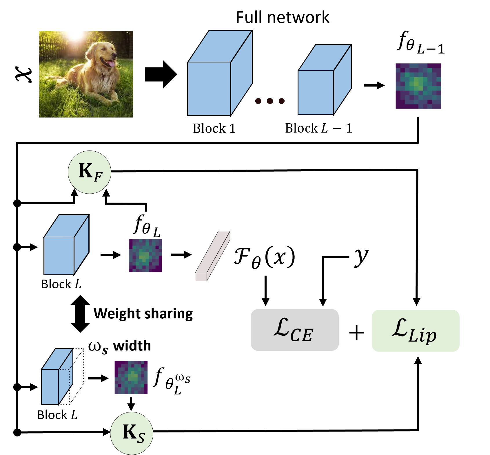

# Local Learning Matters: Rethinking Data Heterogeneity in Federated Learning [\[arxiv\]](https://arxiv.org/abs/2111.14213)

<!-- <p></p> -->


**Abstract:** Federated learning (FL) is a promising strategy for performing privacy-preserving, distributed learning with a network of clients (i.e., edge devices). However, the data distribution among clients is often non-IID in nature, making efficient optimization difficult. To alleviate this issue, many FL algorithms focus on mitigating the effects of data heterogeneity across clients by introducing a variety of proximal terms, some incurring considerable compute and/or memory overheads, to restrain local updates with respect to the global model. Instead, we consider rethinking solutions to data heterogeneity in FL with a focus on local learning generality rather than proximal restriction. To this end, we first present a systematic study informed by second-order indicators to better understand algorithm effectiveness in FL. Interestingly, we find that standard regularization methods are surprisingly strong performers in mitigating data heterogeneity effects. Based on our findings, we further propose a simple and effective method, FedAlign, to overcome data heterogeneity and the pitfalls of previous methods. FedAlign achieves competitive accuracy with state-of-the-art FL methods across a variety of settings while minimizing computation and memory overhead.
<br clear="left"/>

```
@inproceedings{mendieta2022local,
  title={Local Learning Matters: Rethinking Data Heterogeneity in Federated Learning},
  author={Mendieta, Matias and Yang, Taojiannan and Wang, Pu and Lee, Minwoo and Ding, Zhengming and Chen, Chen},
  booktitle={Proceedings of the IEEE/CVF Conference on Computer Vision and Pattern Recognition},
  pages={8397--8406},
  year={2022}
}
```
## Usage
First, simply run the follwing command from within a Python 3 virtual environment to install the required packages:
```
pip install -r requirements.txt
```
Then, you should be able to run a variety of federated learning experiments. For example, the following command will run FedAlign on CIFAR-100:
```
python main.py --method fedalign --client_number 16 --thread_number 16 --comm_round 25 --lr 0.01 --epochs 20 --width 0.25 --mu 0.45 --data_dir data/cifar100
```
There are various flags for different FL settings and methods. Run ```python main.py -h``` to see the options. For instructions regarding the second-order analysis, see [here](pyhessian/README.md).

## ImageNet-200
The ImageNet-200 dataset we experiment with is a subset of ImageNet-1k. To generate ImageNet-200, ensure that you have ImageNet-1k downloaded, and then run the following command:
```
python data_preprocessing/gen_imagenet_subset.py --data_dir /path/to/ImageNet
```
